#  Motor:Bit Product Introduction

[English](README.md) 中文版

- [Product Feature](#产品特色) 
- [Product Photo Show](#产品实物图)
- [Hardware Interface Introduction](#硬件接口介绍) 
- [Motor Function Description](#电机功能说明) 
- [Description Of Each Unit Module Of The Expansion Board](#扩展板各单元模块详解) 
    - [Power Supply Port](#电源供电口)
    - [Buzzer](#蜂鸣器)
    - [Infrared Receiver](#红外接收)
    - [RGB Colourful Light](#RGB炫彩灯)
    - [Dc Motor Interface](#直流电机接口)
    - [8 Way Steering Engine Interface](#8路舵机接口)
    - [Stepper Motor Interface](#步进电机接口)
    - [RGB Ultrasonic Wave](#RGB超声波)
    - [8Pin IO Port Leads Out](#8Pin_IO口引出)
    - [I2C Port](#I2C接口)
    - [Voltage Pin](#电压引脚)
- [Import Software Package](#导入软件包)
- [Program Download](#程序下载)
- [FAQ](#FAQ) 

Micro:Bit is [Emakefun](http://www.emakefun.com/) specifically for Micro:Bit and the development of a drive motor, steering gear, stepper motor of a multifunctional motor drive expansion board.Micro:Bit V2.0 solves the problem that similar driving boards on the market support a single 3.7V battery driving force is seriously insufficient.The drive board adopts the control circuit power supply and the steering gear power supply separate, separate power supply scheme,adopts power chip with large current output to supply power independently to the steering gear,supports DC(6-15 V) input voltage,The driver chip adopts 4 high current driver chips,maximum driving current up to 4A,Easily drive four 24V DC motors or 30 high speed motors simultaneously.The steering gear can also be independently powered by an external power source,can support 8 steering gear control at the same time.The board can be inserted directly or horizontally,inserted directly of method is compatible with control board.Mounting hole compatible with Lego.Can be very convenient to install in their own creative design.Complete library support,Accompanying developments include MakeCode、Scratch3.0、MicroPython libraries and tutorials.

## Product Feature
| Feature | Motor:Bit V1.0|Motor:Bit V2.0|
| ---- | -- | -- |
| Four Onboard RGB   | √ | √ |
| Passive Buzzer    | √ | √ |
| Infrared Receiver Module    | √ | √ |
| Compatible With Lego Holes    | √ | √ |
|  I2C port      | √ （Two PH2.0 interfaces） | √（One PH2.0 interface） |
| RGB Ultrasonic Interface| √ | √ |
| Four-way  Motor      | √ （Maximum output current 1.2A）| √（Maximum output current 4A） |
| 8 Way Steering Gear      | √ | √ |
| 2-way 4-wire Stepper Motor      | √ | √ |
| Onboard Battery Case    | √ | × |
| Onboard Charging Circuit    | √ | × |
| IO Port Multiple Voltage Options | × | √  |
| PCB Board Thickness   | 1.6mm           | 1.6mm           |
| M4 Diameter of the Positioning Hole | 4.6mm，compatible with Lego   | 4.6mm，compatible with Lego |
| Size of Product   | 80mm×56mm×12mm  | 80mm×57mm×12mm  |
| Net Weight        | 37.2g          | 37.2g           |
| Supply Voltage     | 3.7~4.2V        | 6~15V           |
| Diameter of DC Plug    | None | 3.5mm           |


## Product Photo Show
### Motor:Bit V1.0

### Motor:Bit V2.0
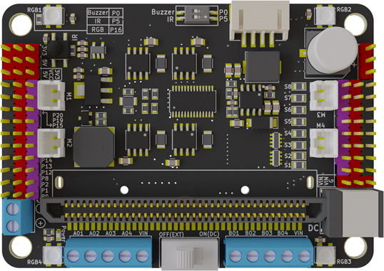

## Hardware Interface Introduction

### Front View
### Motor:Bit V1.0


### Motor:Bit V2.0
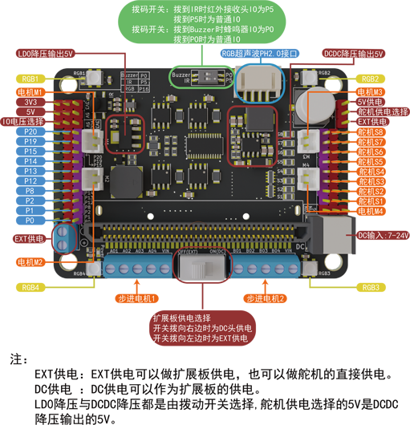


# Description Of Each Unit Module Of The Expansion Board

## Power Supply Port
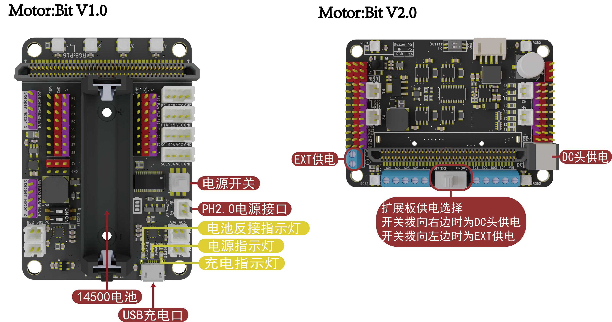
- Motor:Bit V1.0 has two power supply ports,one PH2.0 interface(symbol '+' indicates the positive power line, symbol '-' Indicates the negative power line ),one 14,500 battery case(symbol '+' indicates the positive power line, symbol '-' Indicates the negative power line).The input voltage of the two ports ranges from 3.7V to 4.2V.

- Motor:Bit V1.0  If the charging indicator blinks, it is charging. If it is steady on, it is full.If the battery reverse connection indicator is on, the battery is reversed

- Motor:Bit V2.0 has two power supply ports,one terminal type(symbol '+' indicates the positive power line, symbol '-' Indicates the negative power line ),one DC header type.Note the direction of the positive and negative terminals of the power supply when using terminals for power supply,The port represented by the + symbol on the expansion board terminal indicates that the positive power line should be connected, and the port represented by the - symbol indicates that the negative power line should be connected.

-  Motor:Bit V2.0:When the toggle switch is flipped to the right to OFF(EXT), the motor:bit expansion board is powered by the terminal. At this time, the DC head power supply interface is invalid;When the toggle switch is flipped to the left to ON(DC), the motor:bit expansion board is powered by the DC head interface. At this time, if the VSS wiring cap is connected to 5V, the power supply interface of the terminal post is invalid. If the VSS wiring cap is connected to symbol '+', the VSS is powered directly by the power supply connected to the terminal post, so as to realize one board and two power supply sources.

- The Motor:Bit V2.0 expansion board contains a 3V3, 5V power pin and, in addition, is designed with a VIN pin；The VIN pin is directly connected to the power supply source through the switch, and the VIN pin is connected to the power supply source selected by the switch.
#### Note：The red pins of the Motor:Bit expansion board are all positive power supply leading pins. The black pins are all ground GND pins


## Buzzer
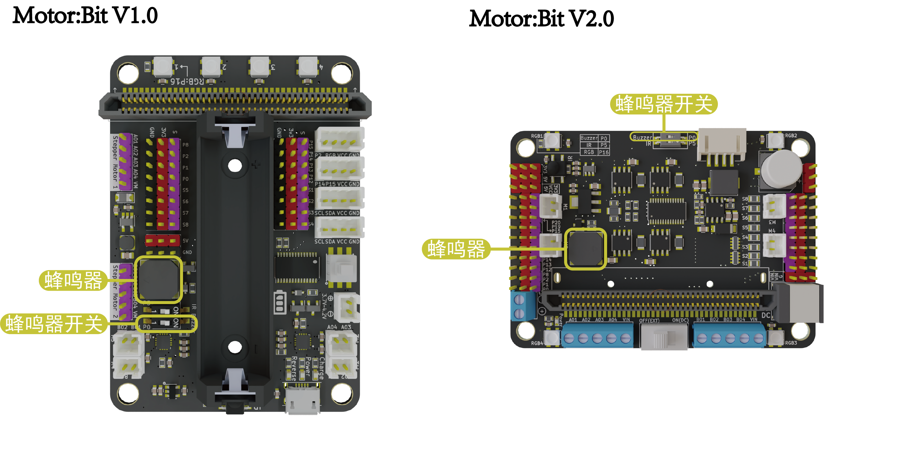

* Motor:Bit V1.0/V2.0 The connection pin of the onboard passive buzzer is P0
* The Motor:Bit V1.0/ V2.0 is connected and disconnected from the P0 pin of the Micro:Bit motherboard via a dip switch. When toggle to off, pin P0 cannot control the onboard buzzer, at which point pin P0 can be used as a normal IO pin。
> The passive buzzer plays music Routine Experiment


> The experimental phenomenon ：When pressing Micro:Bit motherboard A key to play Happy birthday song： When the B key is pressed, the ringtone is played[Buzzer experiment source code](https://makecode.microbit.org/_7T6XPUbgYhcb)

## Infrared Receiver

#### **MakeCode Infrared Extended Library: https://github.com/emakefun/pxt-motorbit


* Motor:Bit V1.0/V2.0 on-board infrared receiver is pin P5
* The infrared receiving head is connected and disconnected with the P5 pin of the microbit motherboard through the dip switch. When toggled to off, pin P5 cannot control the infrared receiving head. At this time, pin P0 can be used as an ordinary IO pin.
> Infrared Receiving Experiment Routine

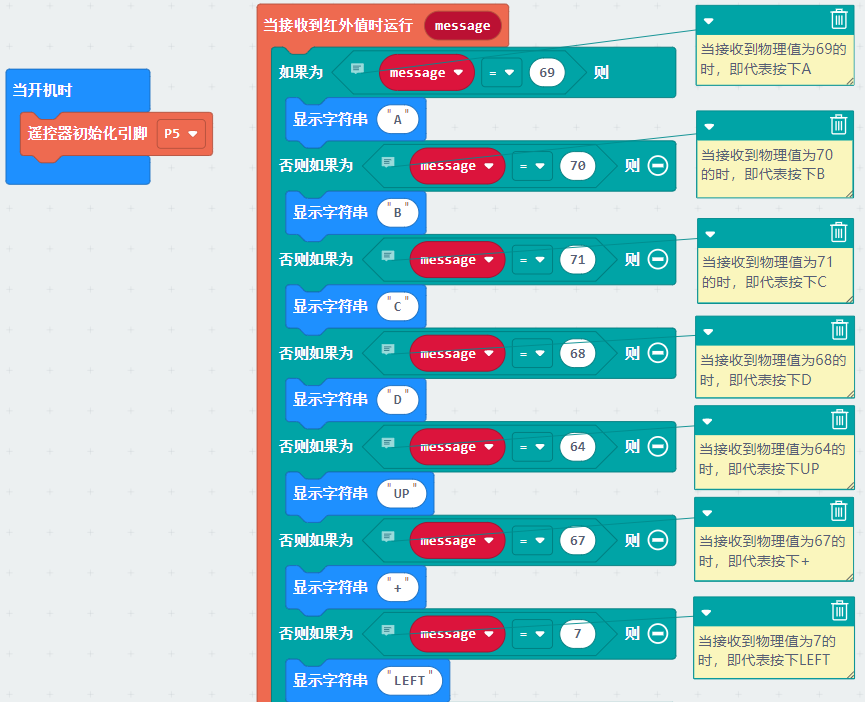

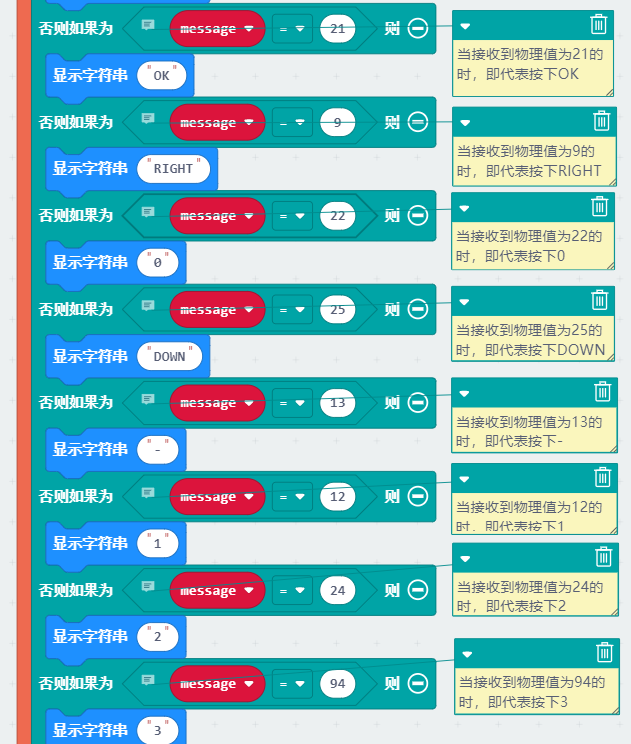


> The experimental phenomenon：Infrared remote control key 'A' pressed, Micro:Bit motherboard display letter "A", key B pressed down, Micro:Bit motherboard display letter "B", key C pressed down, Micro:Bit motherboard display letter "C"   [Click to view the infrared experiment source code](https://makecode.microbit.org/_eAv9yiUC2VV3)。When other functions need to be realized through infrared remote control, you can change the display string into the corresponding logic.


## RGB Colourful Light


* Motor:Bit V1.0/V2.0 onboard 4 RGB full color lights, connected to the P16 pin of the Micro:Bit motherboard, you can control the four RGB lights on/off and color by programming the P16 pin.
> Onboard RGB Experiment Routine


> Experimental design of RGB flow lamp ,experimental result：Onboard RGB lights display red, green and blue colors at a interval of 1s  [RGB Experimental source code](https://makecode.microbit.org/_XD8L8u8s77cD) 


## DC Motor Interface

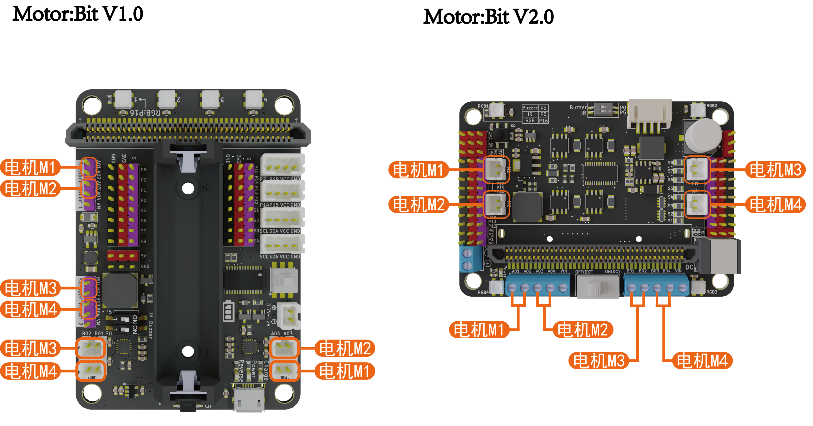

* Motor:Bit V1.0/V2.0 expansion board is designed with four PH2.0 DC Motor connector interfaces: M1,M2,M3,M4
* Motor:Bit V1.0 expansion board can also be connected to M1(A01,A02),M2(A03,A04) and M3(B01,B02)M4(B03,B0) from the pin header position of stepper motor 
* Motor:Bit V2.0 expansion board can also be connected to M1(A01,A02),M2(A03,A04) and M3(B01,B02)M4(B03,B04) from the terminal position of the stepper Motor.
> Control DC motor Routine Experiment


>Physical wiring diagram (DC power supply port, switch to on(DC))


> Experimental result：When the Micro:Bit motherboard A key is pressed, the motor connected to M1(A01A02) rotates clockwise, press the B key, the motor rotates in the opposite direction [Dc motor experiment source code](https://makecode.microbit.org/_6pTH0XCLjYdb)

## 8 way steering gear interface
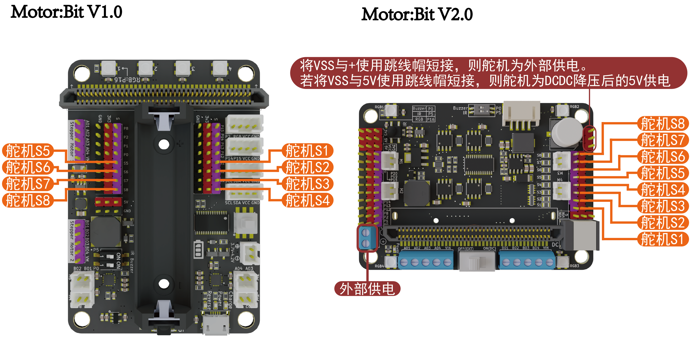

* Motor:Bit V1.0/V2.0 Support drive 8 channel PWM steering gear at the same time
* Motor:Bit V1.0/V2.0  The blue jack of the steering gear pin represents the pin output pwm signal and the PWM input signal line connected to the three-wire steering gear. The red jack represents the positive power terminal and the positive power line connected to the three-wire steering gear. The black jack represents the power GND pole and the negative power line connected to the three-wire steering gear.
* The jacks are S1-S8. When in use, choose from the program building blocks according to the actual connected jacks.
* When driving the steering gear, different power supply modes can be selected through the jumper cap.If the number of large steering gear (such as MG996) exceeds four, the blue terminal must be connected to an external power supply for the steering gear (the external power supply voltage and current must be provided according to the type of the steering gear), and the DC connector must also be connected to a power supply for the expansion board. Flip the switch to ON.

> Physical connection diagram is blow

> 

> Steering gear control experiment routine


> Physical connection diagram, routine experiment select S1 pin, physical connection is also connected to S1 pin


> Control the steering gear to rotate to Angle 160, delay 500ms, at speed 3 and then rotate to Angle 30, delay 500ms, and so on， [Steering gear experimental source code](https://makecode.microbit.org/_Ea1cH3JwmehY)

## Stepper motor interface

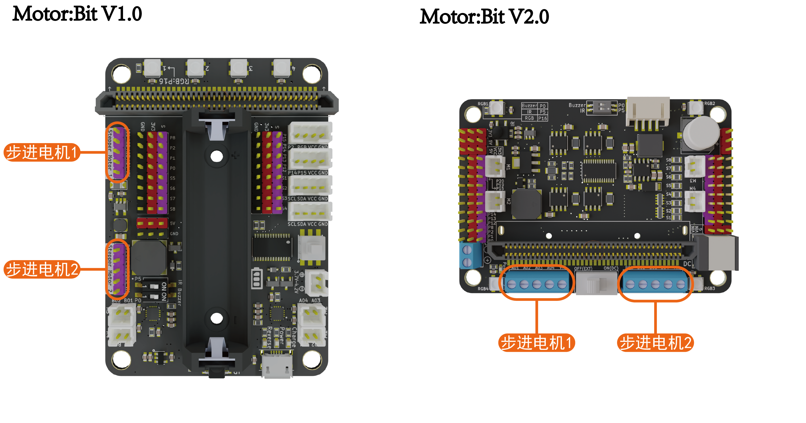

* Contains two 5-wire stepper motors, which can be connected and controlled at the same time.The cables are blue, pink, yellow, orange and red from left to right。
* Stepper motor and TT motor are supported at the same time. For example, one stepper motor and two DC motors can be controlled（Specific collocation can be set according to the needs）

> Stepper motor experiment routine


> physical connection diagram, the routine experiment selects STPM1_2 pins, and the physical connection is also connected to the corresponding pins. Pay attention to the color of different pin connections


> Stepper motor drive experiment，The experimental results are：The stepper motor connected to the STPM1_2 pin rotates 50°, stops the delay of 500ms, and then rotates again, and so on ， [Step motor experiment source code](https://makecode.microbit.org/_41a2Trhpfe55)


## RGB Ultrasonic
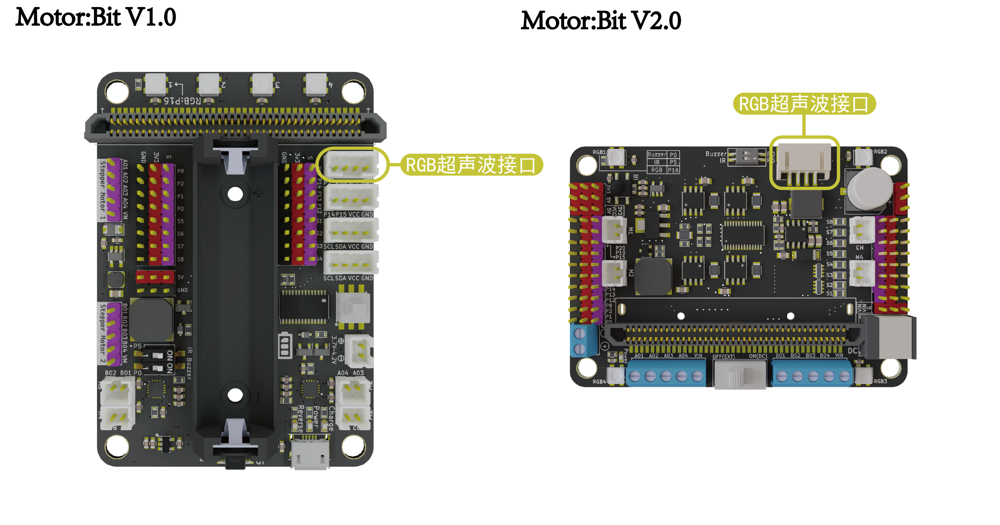

* one PH2.0-4Pin Rg module b Ultrasonic (RUS-04) module interface,The interface has two uses. On the one hand, it can be used as the pin of TX and RX of ultrasonic wave. On the other hand, it can also control the RGB color lights of ultrasonic wave to make the ultrasonic wave module more dazzling and intelligent.
* The IO pin of RGB ultrasonic is connected to the P2 interface of the pin, and the RGB port corresponds to the RGB lamp port：RGB lamp of RGB ultrasonic  is an extension of the expansion board lamp, which is controlled by P16 pin. The control principle is the same as that of the control RGB lamp of expansion board . RGB ultrasonic contains six RGB lamps, with three left and right probes.
* RGB color lights of ultrasonic , you can choose to control the left and right, display color and display effects, which include breathing lights, rotating meteors, flashing。
> Ultrasonic RGB Experiment Routine


> Physical connection diagram, pin P2 is selected for RGB ultrasonic


> When the ultrasonic detects that the front distance is less than 10cm, the RGB lights of the ultrasonic **all**will display**indigo**， and have**flashing**special effects  [RGB ultrasonic experimental source code](https://makecode.microbit.org/_TUqXfUJ2c19c)

## 8Pin IO port leads out
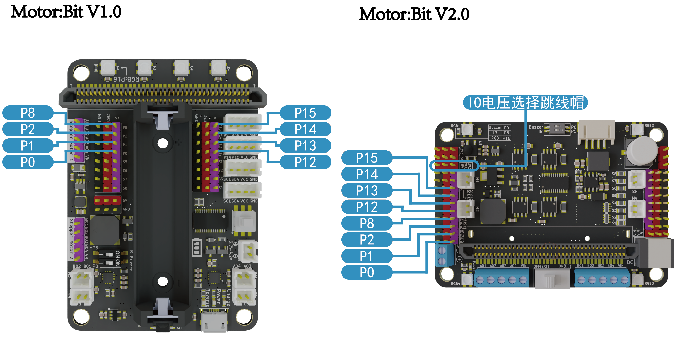

* Motor:Bit V1.0/V2.0 has 8 outgoing IO ports. The black pin represents the negative pole of the power supply, the red pin represents the positive pole of the power supply, and the blue pin represents the IO signal port.
* Motor:Bit V1.0/V2.0 leads to pin P0\P1\P2\P8\P12\P13\P14\P15
* Red pin voltage of Motor:Bit V1.0 is 3.3V
* The red pin voltage of Motor:Bit V2.0 is selected by jumper cap . The red pin voltage is 5V when the jumper cap is inserted into 5V and VCC, and the red pin voltage is 3.3V when the jumper cap is inserted into 3V3 and VCC。

## I2C port


* Motor:Bit V1.0 includes two PH2.0-4Pin I2C interfaces, which can be used to control the LCD 1602 LCD screen, etc.When using I2C for communication, it should be noted that the data line SDA pin of the expansion board is connected to the terminal data line SDA pin, and the clock line SCL pin of the expansion board is connected to the clock line SCL pin of the terminal.
* The Motor:Bit V2.0 includes one i2c interface, which can be used to control the LCD 1602 LCD screen, etc.When using I2C communication, attention should be paid to that the data line SDA pin of extended board is connected to the terminal data line SDA pin, and the clock line SCL pin of extended board is connected to the terminal clock line SCL pin
* Different I2C modules require different voltage. You can adjust the voltage of the red pin of the I2C by using the  jumper cap
> I2C using routines (control LCD1602 display)

 

> Experimental diagram,When connecting cables, note that the SDA pin of the LCD1602 LCD is connected to the SDA pin of the expansion board, the SCL pin is connected to the SCL pin of the expansion board, the GND pin is connected to the black GND pin of the expansion board, and the VCC pin is connected to the red 5V pin of the expansion board. Different I2C modules require different voltage, and the LCD1602 LCD requires 5V(Pay attention to adjust the knob on the back of the LCD to adjust the display effect to achieve the best display)


> The experimental phenomenon is：LCD1602 LCD first line display**`Hello! emakefun!`**    ，The second line shows**`2020 2 2`** [LCD1602 LCD experiment source code](https://makecode.microbit.org/_6s8UXUHCo67w)

## Voltage pin

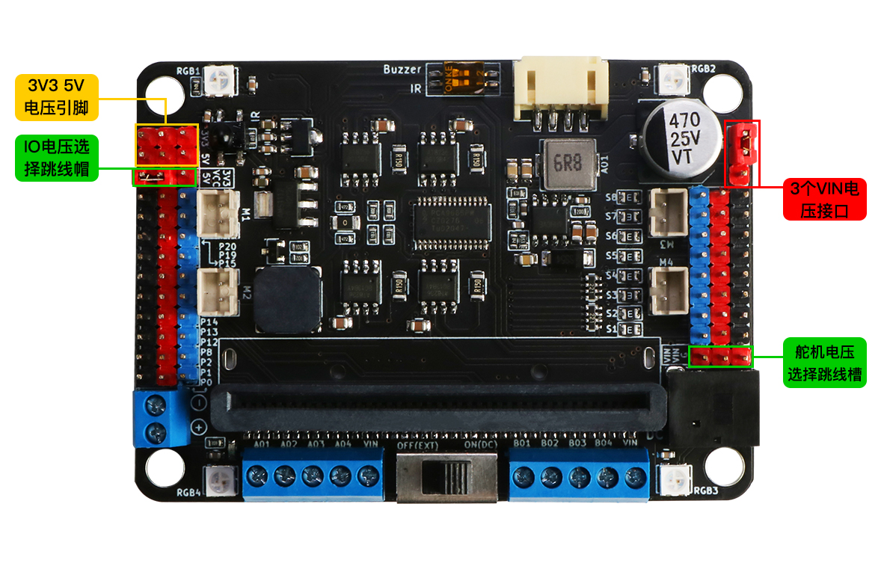

* Motor:Bit expansion board design has three voltage pins, respectively 3V3, 5V, VIN(+,Voltage interface without step-down)
* For the eight I/O ports, you can select different voltages through the I/O port jumper caps：For 8 PWM steering gear interfaces, different voltages can be selected through jumper caps，Note that when 5V is selected, the power supply is directly related to the power supply selected by the switch. When + is selected, the power supply source is the terminal power supply, which has nothing to do with the switch selection


## Import software package

### Open the programming page

* [Click makecode](https://makecode.microbit.org/) Enter the programming official website

### New project
* Click**`New project`** pointed by the black arrow to enter the programming interface


### Add packages
* Click**`advanced`**—>**`extension`**—>input the web address**`https://github.com/emakefun/pxt-motorbit.git`**Click search—>Click motorbit package


## Program download

### Click Download button
* Click**`Download`**,    the button indicated by The red arrow  

### Save to a Microbit USB flash drive. During the saving, the micro:bit indicator blinks
* Select**`MICROBIT`**，click OK (QQ browser is used for online download)


* Click download（As long as the microbit program file is downloaded or saved to the microbit motherboard's memory disk named**`MICROBIT`**,the program will run in microbit）


## micropython syntax
If you want to support python syntax, you need to download the firmware to Micro:Bit

[Click to download the latest Micro:Bit V1 firmware](http://www.emakefun.com/firmware/firmware_v2.hex)

[Click to download the latest Micro:Bit V2 firmware](http://www.emakefun.com/firmware/firmware_v2.hex)

- Dc motor control：
> dcmotor_run(index, speed)    # index: 1/2/3/4（Motor serial number）, speed: -255~255 (Motor speed)
> dcmotor_stop(index)   # Stop DC motor index: 1/2/3/4 (Motor serial number)

```
#Motor No.1 is going forward at 150 and motor No.2 is going backwards at 200
import motor
motorbit = motor.init()
motorbit.dcmotor_run(1, 150)   # Tributary motor M1 has a forward rotation speed of 150
motorbit.dcmotor_run(2, -200)   # Tributary motor M1 rotates in reverse direction at a speed of 200
sleep(2000)
motorbit.dcmotor_stop(1)
motorbit.dcmotor_stop(2)
```

- Stepper motor motion：
> stepper(index, degree)  # index: 1/2 (Stepper motor serial number) , degree: -360~360 (rotation angle)
```
# Control stepper motor No.1 to rotate 150 degrees
import motor
motorbit = motor.init()
motorbit.stepper(1, 150)
```

- PWM steering gear control
：
> servo(index, degree, speed=10) inedx: 1/2/3/4/5/6/7/8 (The serial number of the steering gear, corresponding to s1/s2/s3/s4/s5/s6/s7/s8) , degree: 0~180 (degree of azimuth) , speed: 1~10（The rotation speed of the steering gear may not be entered）

```
# Control the rotation of the steering gear connected to the S1 pin to the 90° position
import motor
motorbit = motor.init()
motorbit.servo(1, 90)
```
```
#Control the steering gear connected to the S1 pin to turn at 5 speed to the 90° position
import motor
motorbit = motor.init()
motorbit.servo(1, 90, speed=5)
```


# FAQ:
1. Motor non-rotation？

Answer：MotorMotor:Bit V1.0 Check whether the battery is charged. Check the power switch.MotorMotor:Bit V2.0 Check whether the DIP switch is toggle to the corresponding position.

2. Power supply mode?

Answer： 
Motor:Bit V1.0 The first power supply mode supplies power by the 14500 lithium battery, and the second power supply mode supplies power by the PH2.0 interface. The two power supply modes range from 3.7V to 4.2V。
MotorMotor:Bit V1.0 The first power supply mode supplies power by the 3.5mm terminal and the second power supply mode supplies power by the 3.5mmDC terminal. The two power supply modes supply voltage ranging from 6V to 15V。Please refer to the power supply port for details

- [Power supply port](#电源供电口)

3. RGB Ultrasound, how does RGB drive？

Answer：RGB beads of RGB ultrasonic  are in series onboard RGB beads and are driven by P16。

4. Motor:Bit V2.0 The steering gear non-rotation？

Answer：Please first determine the power supply voltage of the steering gear, and then check whether the voltage selection of Motor:Bit V2.0 extended steering gear is correct. Please check for details

- [8 way steering gear interface](#8路舵机接口)