# Motor: Bit Overview

[中文版](README_zh.md)

Motor: BIT is a multi-functional motor drive expansion board specially developed for micro: BIT, DC motor and stepper motor developed by emakefun. It solves the problem of insufficient driving force of a single 3.7V battery supported by the same type of drive board on the market. The drive board adopts separate control circuit power supply and steering gear power supply, separate power supply scheme, the use of high current output power chip for independent power supply of steering gear, support DC(6~15V) voltage input, maximum output 5A current, control circuit maximum output 1A current, to ensure the stable operation of the system. Drive chip adopts 4 high current drive chip, the maximum drive current up to 4A, easily drive 4 24V DC motor or 30 violent high-speed motor at the same time. The steering gear can also be independently powered by external power supply, and can be controlled by 8 steering gear at the same time. The board can be either vertically inserted or horizontally inserted, which is compatible with the control board. The mounting hole is lego-compatible and can be easily installed in your own creative design. Perfect library support, supporting development makecode, scratch3.0, mixly, python library and tutorials.

## Feature

1. Contains a variety of voltage pins to meet the needs of most scenarios
2. Compatible with Lego, better, more and more creative functions can be achieved through different building blocks and motor:bit, giving full play to students' creativity

3. Support driving 8-channel steering gear and 4-channel DC motor at the same time

4. Support to drive 2 4-line stepper motors

5. Onboard 4 RGB full color lights, passive buzzer

6. Onboard infrared receiving head, infrared remote control through infrared remote control

7. A PH2.0-4PIN RGB ultrasonic interface, anti-backinsertion interface


## Parameters
* PCB board thickness: 1.6mm
* Large round hole diameter: 4.6mm

* Product size: 80mm×57mm×12mm

* Net weight: 37.2g

* Input voltage: 6~36V

## Physical product drawing
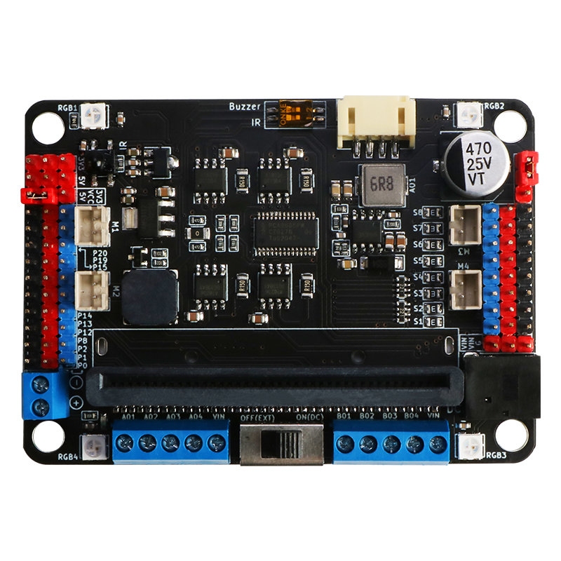

## Hardware interface

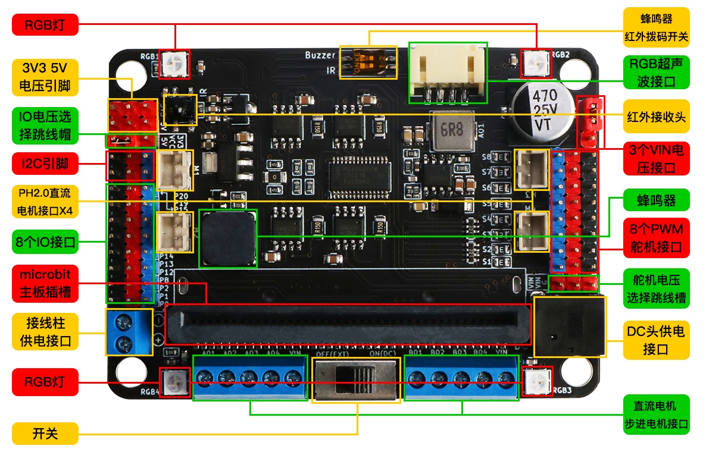

# Detailed description of each module of the expansion board

## Power supply port
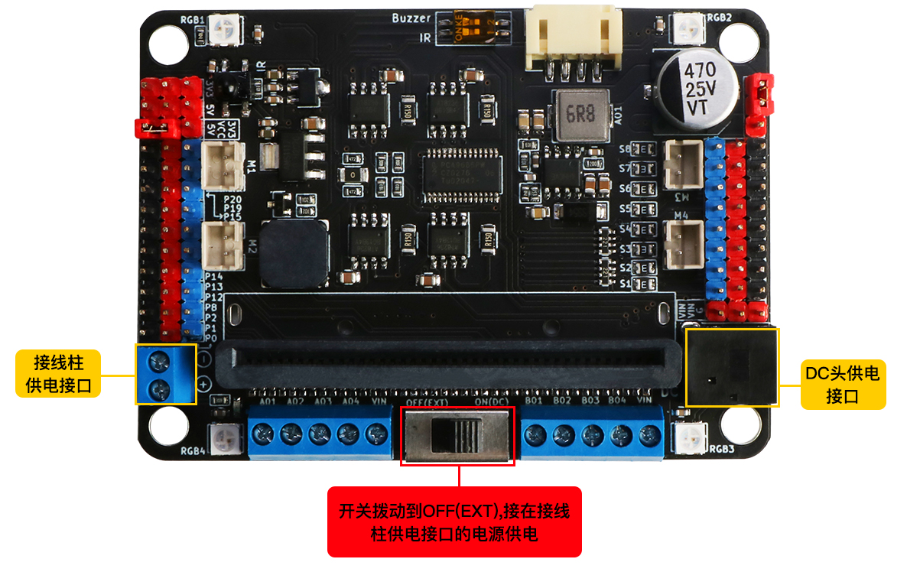

- motor:bit Has two power supply ports, one terminal type (+ indicates that it is connected to the positive power cable, and - indicates that it is connected to the negative power cable), and one DC connector type. When using the terminal post for power supply, pay attention to the connection direction of the positive and negative terminals of the power supply. The + symbol for the terminal post on the expansion board indicates that the terminal port should be connected to the positive power cable, and the - symbol indicates that the terminal port should be connected to the negative power cable
- When toggle switch is toggle right to OFF(EXT), the motor: BIT expansion board is powered through the terminal, at this time, the DC head power supply interface is invalid: When the toggle switch is turned left to ON(DC), the motor: BIT expansion board is powered by the DC head interface. At this time, if the VSS wiring cap is connected to 5V, the power supply interface of the junction post is invalid. If the VSS wiring cap is connected to +, the power supply of VSS is directly powered by the power supply connected to the junction post, so as to realize one board and two power supply sources
- Motor: BIT expansion board contains 3V3, 5V power pin, in addition, also designed a VIN pin, VIN pin is directly connected to the power supply through the switch, VIN pin is connected to the power supply selected by the switch
- motor: red pins of bit expansion board, all are positive power supply pins; black pins are ground GND pins


## Buzzer
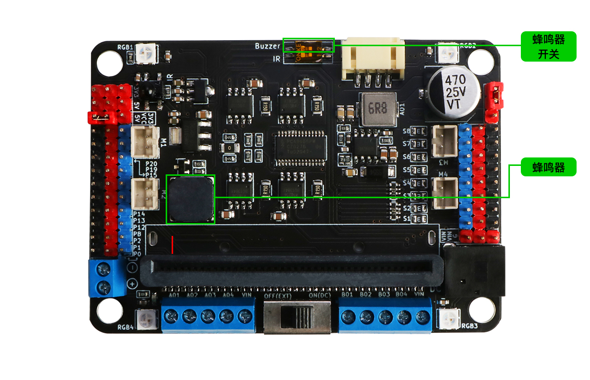

* Motor: BIT Onboard passive buzzer, motor: BIT buzzer wiring pin P0, by output signals of different frequencies to the buzzer, so as to control the buzzer to play music.
* Motor: BIT is connected to and disconnected from pin P0 on the Microbit motherboard by a dip switch. Pin P0 cannot control the onboard buzzer when toggle to off, and pin P0 can be used as a common IO pin.
> Buzzer music playing routine experiment

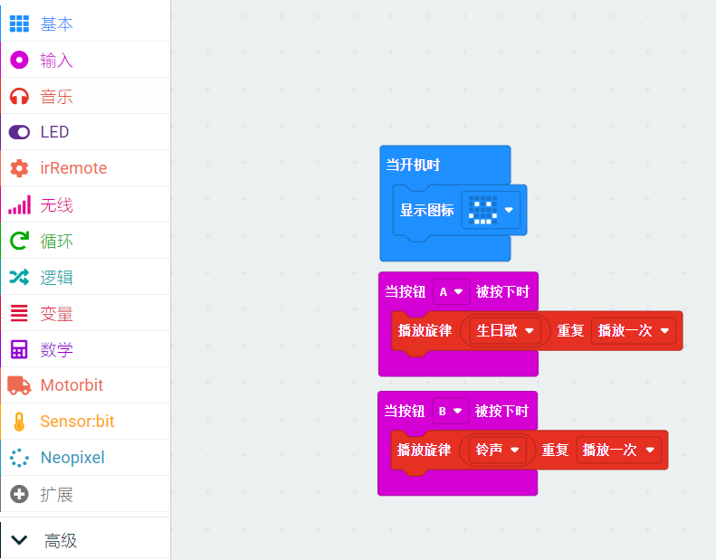

> The experimental phenomenon is as follows: When button A of micro:bit motherboard is pressed, the birthday song will be played; when button B is pressed, the ringtone will be played[Buzzer experiment source code](https://makecode.microbit.org/_Rf1MMALz2CK8)


## The infrared receiving
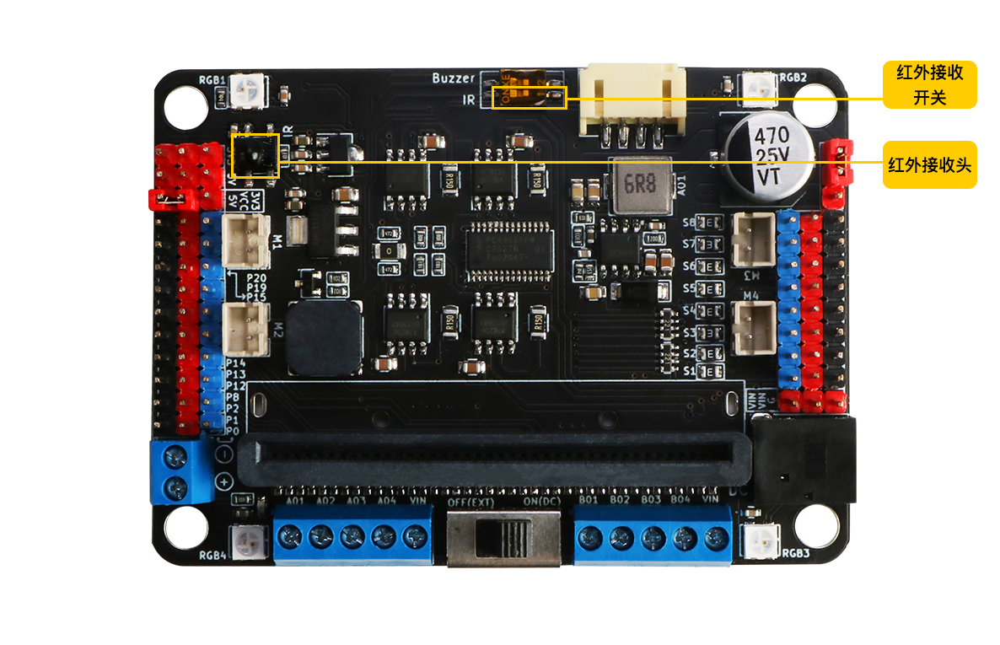

*  Motor: BIT board contains an infrared receiving head, you can drag the corresponding program blocks to set the corresponding functions, and then use emakefun infrared remote control to control.
* The infrared receiver is connected to and disconnected from the P5 pins of the Microbit motherboard through a DIP switch. When the switch is turned off, pin P5 cannot control the infrared receiver, and pin P0 can be used as a common IO pin.
> Infrared receiving experiment routine


> Experimental phenomenon: infrared remote control button 'A' press, micro: BIT motherboard display letter "A", button B press, micro: BIT motherboard display letter "B", button C press, micro: BIT motherboard display letter "C"[Infrared experiment source](https://makecode.microbit.org/_Czy5x2fuiioa)


## RGB color lamp
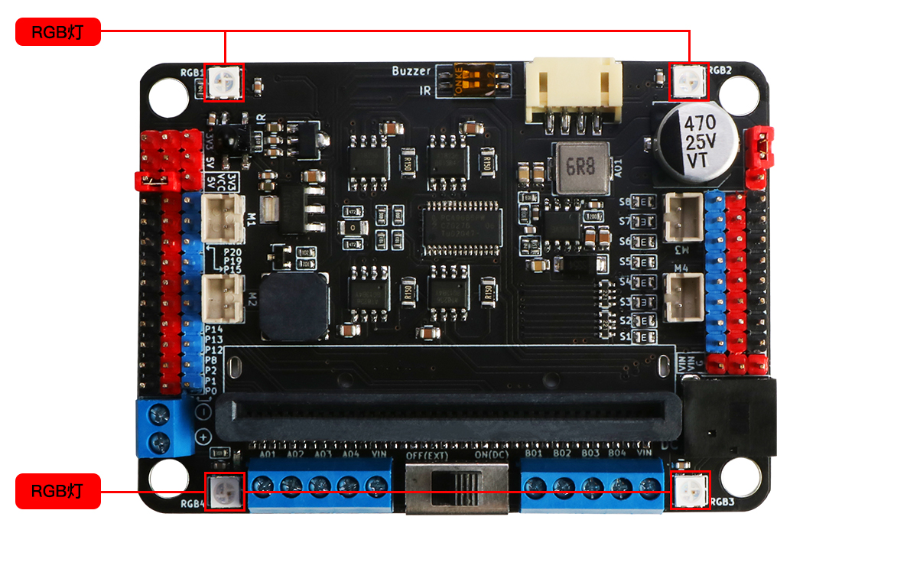

* Onboard 4 RGB full color lights, connected to the MICRObit motherboard P16 pin, you can control the four RGB light on and off and color by programming the P16 pin.
> Onboard RGB experimental routines

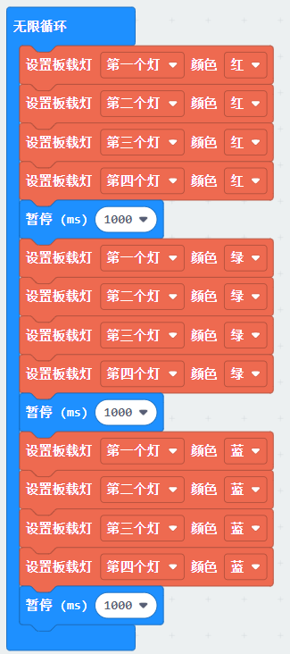

> RGB flow light experimental design, the experimental results are: onboard RGB light into green flow light  [RGB实验源码](https://makecode.microbit.org/_XD8L8u8s77cD) 


## DC motor interface


* Motor: BIT expansion board is designed with 4 DC motor terminal interfaces, respectively: A01 and A02, A03 and A04, B01 and B02, B03 and B04. When connecting the motor, the two lines of the motor should correspond to the pins. When using terminal connections, a screwdriver can be used to tighten or loosen the motor lines by rotating the terminal screws.
* When connecting dc motor, pay attention to the relative position of the two lines, different wiring, the rotation direction of the program is different. If the red wire of the DC motor is connected at A01 and the black wire is connected at A02, the brushing-in procedure motor rotates clockwise (related to the positive and negative wiring of the motor) : when the red wire of the motor is connected at A02 and the black wire is connected at A01, the motor will rotate counterclockwise when the same procedure is brushed
> Control dc motor routine experiment

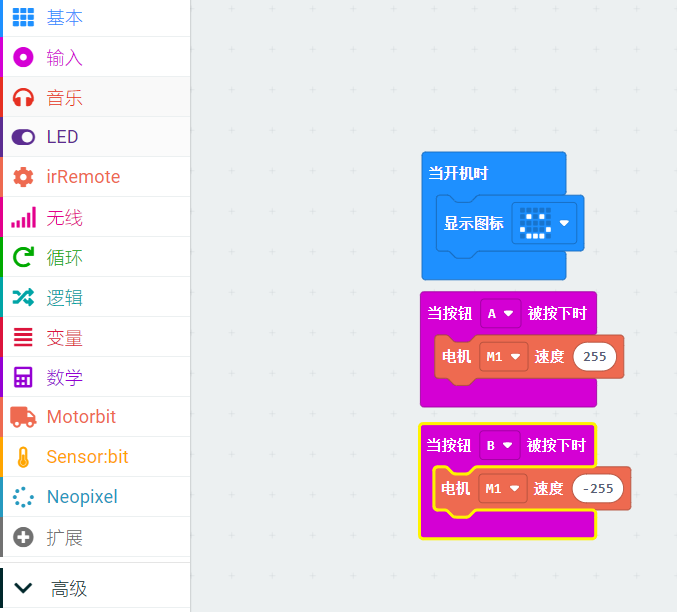

>Physical wiring diagram (DC power supply port, switch toggle to ON (DC))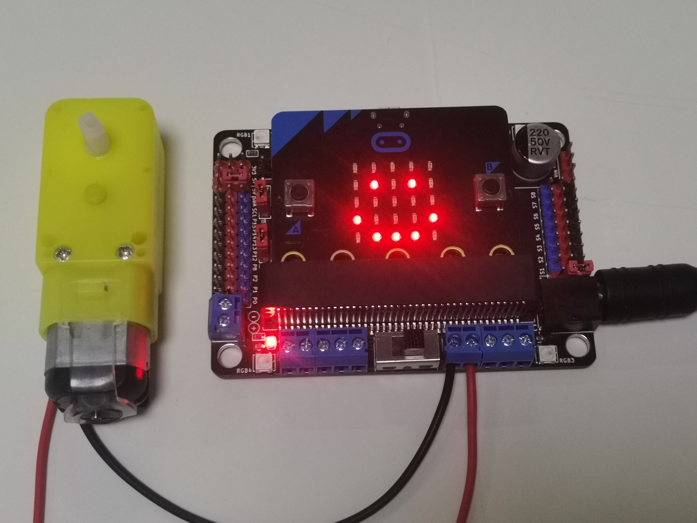

> Experimental results: When the button A of microbit motherboard is pressed, the motor connected to pins A01 and A02 turns clockwise or counterclockwise (related to wiring direction), and the button B is pressed, and the motor turns in the opposite direction [DC motor experimental source code](https://makecode.microbit.org/_2h2Jb0TeDUug)

## 8 servo interface
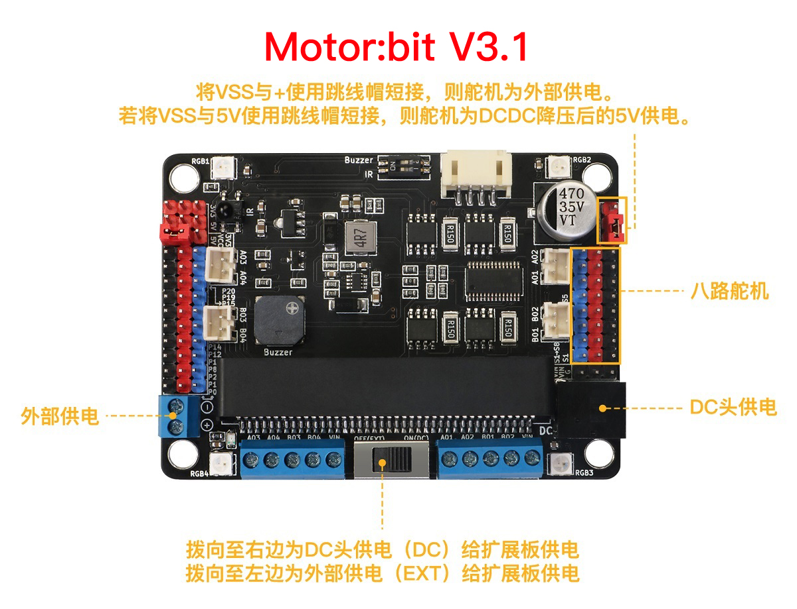

* Motor: BIT simultaneously supports drive 8-channel PWM steering gear, extended version of the steering gear interface specifications unified, convenient wiring
* Motor :bit The blue jack of steering gear pin represents the pin of output PWM signal and the PWM input signal line connected to the three-wire steering gear. The red jack represents the positive power supply and the positive power supply line connected to the three-wire steering gear. The black jack represents the power GND pole and the negative power supply line connected to the three-wire steering gear.
* The socket is S1~S8, in use, according to the actual connected socket, select in the program building block.
* Motor:Bit When driving the steering gear, you can choose different power supply mode by jumper cap. If the number of large steering gear (such as MG996) exceeds four, the blue terminal must be connected to external power supply for the steering gear (the external power supply voltage and current need to be provided according to the model of the steering gear), and the DC connector must be connected to power supply for the expansion board, and the totol switch must be switched to the ON terminal.

> The physical connection is shown below

> 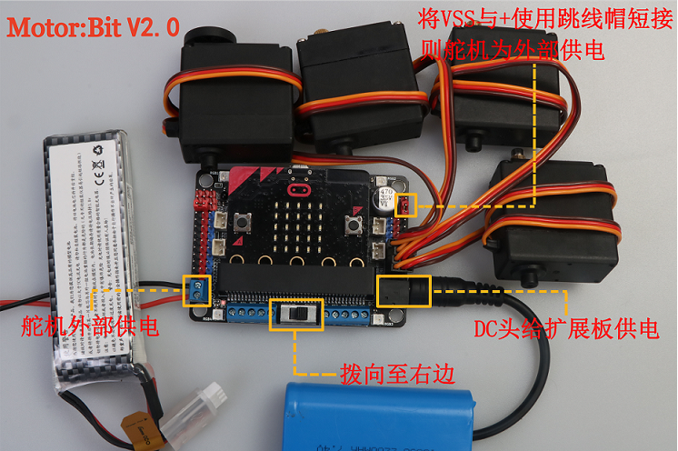

> Servo control experiment routine

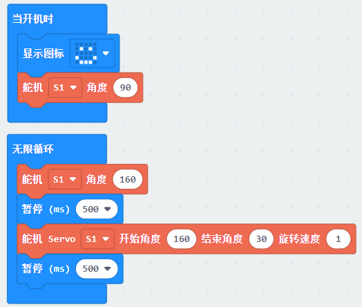

> For the physical connection diagram, S1 pin is selected for routine experiment, and the physical connection is also connected to S1 pin


> Control the steering gear to turn to Angle 160, delay 200ms, then turn to Angle 30 at speed 3, delay 200ms, and so on. [Servo experiment source code](https://makecode.microbit.org/_YtLRRw0jzJcv)

## Stepper interface


* Contains two 5-line stepper motors, which can be connected and controlled at the same time. The cables are blue, pink, yellow, orange, and red from left to right.
* Support stepper motor and TT motor to use at the same time, for example, can control a stepper motor and two DC motors (specific collocation can be set according to needs)

> Step motor experiment routine


> Physical connection diagram, routine experiments choose STPM1_2 pin, physical connection is also connected to the corresponding pin, pay attention to the color of different pin wiring

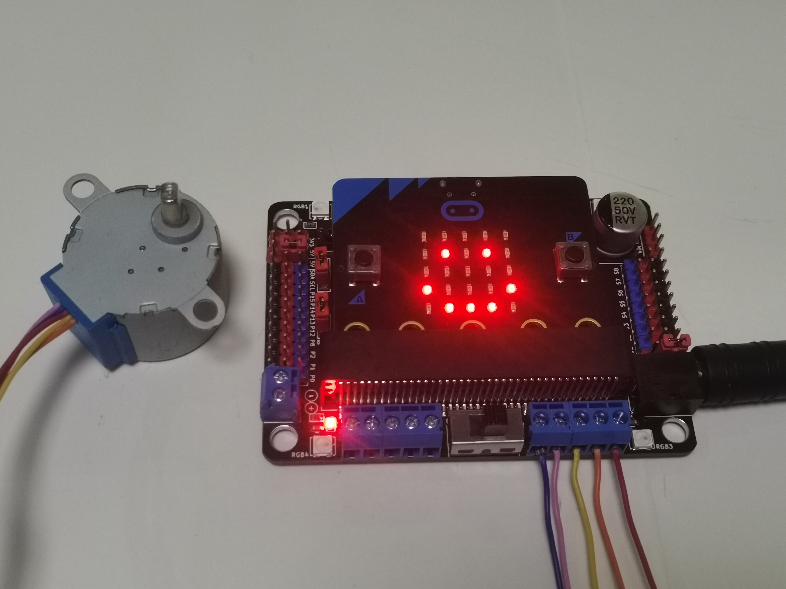
> Stepper motor driving experiment, the experimental results are as follows: the stepper motor connected to the STPM1_2 pin rotates 50°, stops delay 500ms, and rotates again, and so on   [Stepper motor experimental source code](https://makecode.microbit.org/_9rV730UKqCsE)


## RGB超声波


* 1 PH2.0-4PIN Rgb ultrasonic (RUS-04) module interface, the interface has two purposes, on the one hand can be used as ultrasonic TX and RX pin ports, on the other hand can also control the Rgb lights of the ultrasonic module, so that the ultrasonic module more colorful spirit.
* RGB ultrasonic IO pin is connected to pin P2 interface, RGB port and RGB port corresponding: RGB ultrasonic RGB light is an extension of the expansion board light, are controlled by P16 pin, control principle and control expansion board RGB light is the same, RGB ultrasonic contains six RGB lights, left and right probes three each.
* Ultrasonic RGB lights, you can choose to control the left and right, display color and display special effects, which include breathing lights, rotating meteor, flashing.
> Ultrasonic RGB using routine experiments


> Physical connection diagram, RGB ultrasonic pin choose P2

> When the ultrasonic detection to the front distance is less than 10cm, ultrasonic RGB lights all will show indigo, and flashing special effects [RGB ultrasonic experiment source code](https://makecode.microbit.org/#editor)

## 8Pin IO口引出


* Eight leading I/O ports. Black pins represent the negative power supply, red pins represent the positive power supply (3V3/5V), and blue pins represent the I/O signal port
* The leading pin is P0\P1\P2\P8\P12\P13\P14\P15

## I2C接口
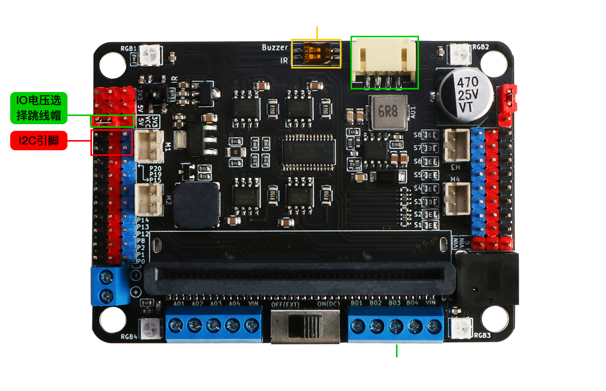

* Motor: Bit extension includes a PH2.0-4pin I2C interface, which can be used to control the 1602 LCD, etc. When using I2C communication, note that the SDA pins of the extended data cable are connected to the SDA pins of the terminal data cable, and the SCL pins of the clock cable of the extended version are connected to the SCL pins of the terminal clock cable
* Different I2C modules need different voltages. The voltage of I2C red pins can be adjusted by IO voltage selection jumper cap
> I2C usage routines (control LCD1602 display)

 

> When wiring, note that the SDA pin of LCD1602 liquid crystal is connected to the SDA pin of the expansion board, the SCL pin is connected to the SCL pin of the expansion board, the GND pin is connected to the black GND pin of the expansion board, and the VCC pin is connected to the red 5V pin of the expansion board. Different I2C modules require different voltage. LCD1602 LCD needs 5V(pay attention to adjust the knob on the back of the LCD to adjust the display effect to achieve the best display)

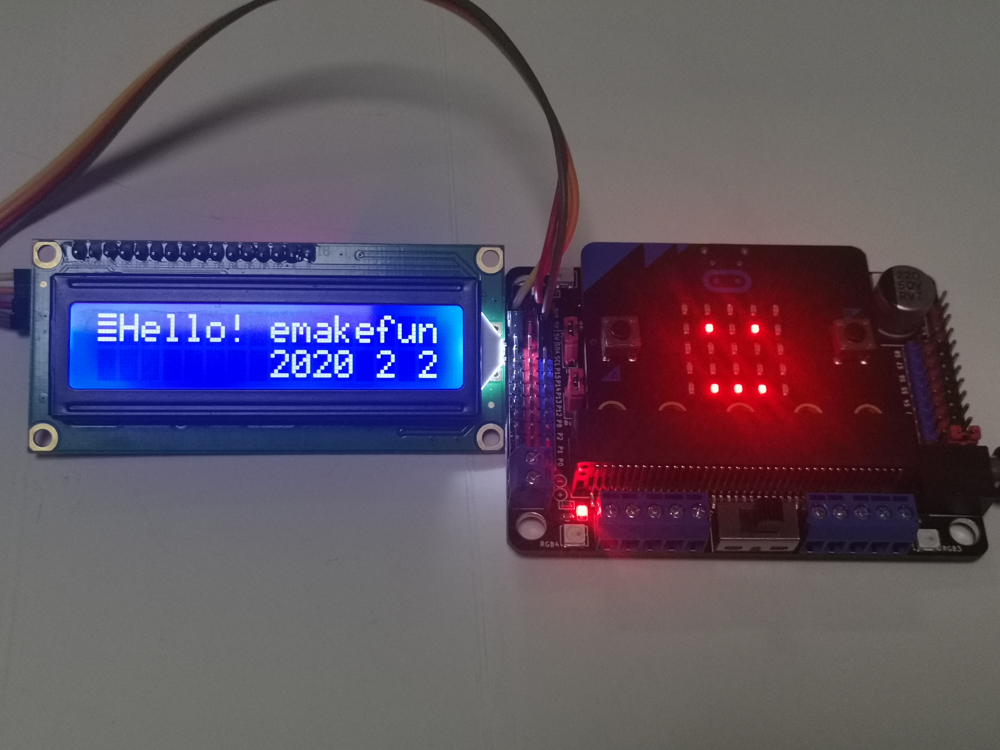

> Experimental phenomenon is: LCD1602 LCD first line display Hello! emakefun! , the second line shows 2019 [LCD1602液晶实验源码](https://makecode.microbit.org/_6s8UXUHCo67w)

## Voltage pin


* Motor: BIT expansion board is designed with three voltage pins, respectively 3V3, 5V, VIN(+, without step-down voltage interface)
* for 8 IO mouth, can through IO mouth jumper cap to select different voltage: for 8 PWM servo interface, can choose different voltage through the jumper cap, it should be noted that when choose 5 v power supply from the switch power supply is directly related to the selection, choose the '+', power source for the terminal power supply, has nothing to do with the switch selection


## Importing a Software Package

### Open programming web page

* [Click makecode](https://makecode.microbit.org/)  Enter the official website of programming

### New project
* Click the new project pointed by the black arrow to enter the programming interface
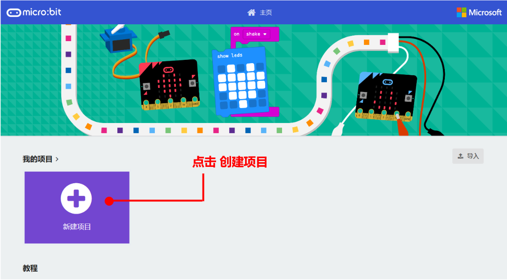

### Add a package
* Click the advanced - > extension - > enter https://github.com/emakefun/pxt-motorbit.git click search - > click motorbit package
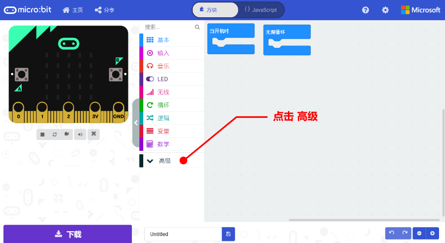


## Program download

### Click the Download button
* Click download, the button indicated by the red arrow

### Save to the USB flash drive of Microbit. During the saving process, the micro:bit indicator blinks
* Select MICROBIT and click OK (download online using QQ browser)


* Click Download (as long as you download or save the microbit program file to the microbit motherboard memory disk named Microbit, the program will run in Microbit)


## Micropython grammar
To support Python syntax, you need to [download the latest firmware](https://raw.githubusercontent.com/emakefun/emakefun-docs/master/docs/micro_bit/sensorbit//firmware.hex) to Microbit

- DC motor control：
> dcmotor_run(index, speed)    # index: 1/2/3/4（The motor serial number）, speed: -255~255 (The motor speed)
> dcmotor_stop(index)   # Stop dc motor index: 1/2/3/4 (The motor serial number)

```
#Motor number one is going forward at 150 and motor number two is going backwards at 200
import motor
motorbit = motor.init()
motorbit.dcmotor_run(1, 150)   # Tributary motor M1 forward rotation speed 150
motorbit.dcmotor_run(2, -200)   # Tributary motor M1 reverse rotation speed 200
sleep(2000)
motorbit.dcmotor_stop(1)
motorbit.dcmotor_stop(2)
```

- Stepper motor movement：
> stepper(index, degree)  # index: 1/2 (Step motor serial number) , degree: -360~360 (The rotation Angle)
```
# Control stepper motor no. 1 to turn 150 degrees
import motor
motorbit = motor.init()
motorbit.stepper(1, 150)
```

- PWM steering gear control:
> servo(index, degree, speed=10) inedx: 1/2/3/4/5/6/7/8 (The serial number of steering gear corresponds to S1 / S2 / S3 / S4 / S5 / S6 / S7 / S8 respectively) , degree: 0~180 (Angle position) , speed: 1~10（Servo rotation speed, can not input）

```
# Control steering gear connected to S1 to 90° position
import motor
motorbit = motor.init()
motorbit.servo(1, 90)
```
```
#Control the steering gear connected to pin S1 to rotate at 5 speed to 90° position
import motor
motorbit = motor.init()
motorbit.servo(1, 90, speed=5)
```